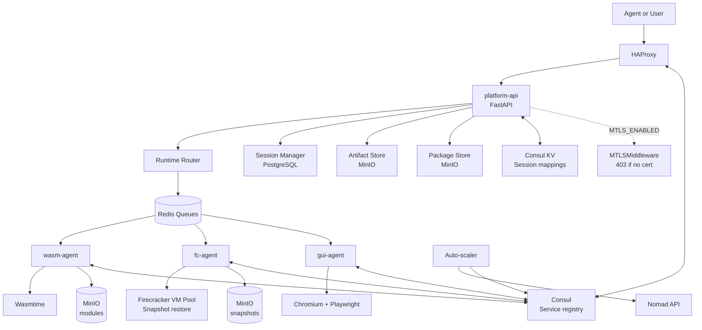
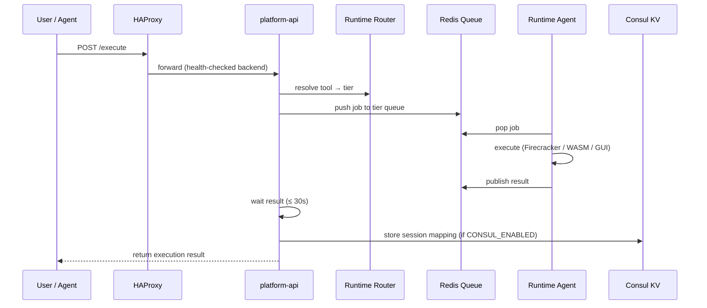

# System Overview

| Field | Value |
|---|---|
| Status | Active |
| Audience | Contributors, reviewers, operators |
| Scope | System diagram, components, data flows, and advanced infrastructure |
| Last updated | April 8, 2026 |

## Executive summary

The platform separates business logic from workload placement. The control plane owns routing, policy, session lifecycle, and artifact coordination. Nomad places work onto runtime-specific agents, which execute tools through WASM, Firecracker, or GUI environments. Consul provides service discovery and distributed session state. HAProxy load balances across runtime agents. An auto-scaler adjusts node counts based on pool utilization.

---

## Main system diagram



---

## Components

| Component | Language / Tech | Responsibility |
|---|---|---|
| `platform-api` | Python / FastAPI | Main HTTP API: sessions, execute, artifacts, packages |
| `fc-agent` | Python | Firecracker runtime worker; pops from `microvm` queue |
| `wasm-agent` | Python | WASM runtime worker; pops from `wasm` queue |
| `gui-agent` | Python | GUI runtime worker; pops from `gui` queue |
| HAProxy | HAProxy | Load balancer; backends populated from Consul |
| Consul | HashiCorp Consul | Service registry, health checks, session KV store |
| Nomad | HashiCorp Nomad | Job scheduling and placement |
| Auto-scaler | Python asyncio task | Reads pool metrics; calls Nomad scaling API |
| PostgreSQL | psycopg2 | Session and job metadata |
| Redis | redis-py | Job queues per runtime tier |
| MinIO | minio SDK | Artifacts, WASM modules, Firecracker snapshots, package wheels |

---

## End-to-end request lifecycle



1. HAProxy receives the request and forwards to a healthy `platform-api` instance.
2. The runtime router maps the tool name to a runtime tier (WASM, Firecracker, or GUI).
3. A job is pushed to the matching Redis queue.
4. The runtime agent pops the job and executes it.
5. The result is published back to Redis; `platform-api` returns it to the caller.
6. If Consul is enabled, the session-to-VM mapping is stored in Consul KV.

---

## Service discovery and load balancing

HAProxy is the external entry point. Backends are populated dynamically from Consul's service catalog using `consul-template`. When an agent registers or deregisters, `consul-template` re-renders `haproxy.cfg` and reloads HAProxy with zero connection drops.

```
Consul service catalog
    ↓ consul-template watches
haproxy.cfg (re-rendered)
    ↓ haproxy graceful reload
HAProxy backend pool updated
```

Configuration files:

| File | Purpose |
|---|---|
| `infra/haproxy/haproxy.cfg.j2` | Jinja2 template for static deployments |
| `infra/haproxy/haproxy.cfg.ctmpl` | Go template for consul-template dynamic reload |
| `infra/haproxy/consul-template.hcl` | consul-template config with HAProxy reload command |

---

## Session state distribution

Session-to-VM mappings are stored in Consul KV at `sandbox/sessions/{session_id}`. This makes routing stateless: any `platform-api` instance can look up which VM owns a session without affinity to a specific node.

```
Key:   sandbox/sessions/{session_id}
Value: {
  "vm_id": "abc123",
  "node_id": "node-xyz",
  "agent_address": "10.0.1.5:8080",
  "created_at": "...",
  "expires_at": "..."
}
```

Sessions auto-expire via Consul TTL. Agent crashes do not leave orphaned session entries.

---

## Auto-scaling

The scaler runs as a background `asyncio` task inside `platform-api`. Each tick (default: 60 seconds):

1. Collect pool utilization metrics from all runtime nodes.
2. Evaluate the scaling policy.
3. Call the Nomad job scaling API if utilization is above or below thresholds.

Cooldown periods prevent thrashing:

| Event | Cooldown |
|---|---|
| Scale up | 5 minutes |
| Scale down | 10 minutes |

The scaler respects `SCALER_MIN_NODES` and `SCALER_MAX_NODES` hard limits. Nomad's migrate stanza drains existing allocations before reducing the count.

---

## Network addressing (Firecracker)

Each Firecracker VM gets a unique TAP device and MAC address to prevent collisions in multi-node deployments.

| Item | Format | Example |
|---|---|---|
| TAP device | `tap-{node_short}-{vm_short}` | `tap-n1a2-v8f3` |
| MAC address | `06:00:{node[0]:02X}:{node[1]:02X}:{vm[0]:02X}:{vm[1]:02X}` | `06:00:AC:10:00:01` |

Both are deterministically derived from node ID and VM ID using SHA-256, so no central registry is needed.

---

## Security: mTLS

When `MTLS_ENABLED=true`, the platform enforces mutual TLS on all inbound requests to `platform-api`. `MTLSMiddleware` returns HTTP 403 if the client certificate is absent.

| Property | Value |
|---|---|
| TLS minimum version | 1.3 |
| Key type | ECDSA P-256 |
| Cert validity | 1 year, rotated every 30 days |
| CA | Internal root CA, self-managed |
| Cert storage | `/etc/sandbox/certs/` |

`CertManager.reload()` hot-swaps the certificate chain on the live `ssl.SSLContext` without dropping in-flight connections.

---

## Deployment topology

| Node | Role | Services |
|---|---|---|
| `node1` | Control node | platform-api, HAProxy, Consul server, Nomad server, PostgreSQL, Redis, MinIO |
| `node2` | Runtime node | fc-agent, wasm-agent, Nomad client, Consul client |
| `node3` | Runtime node | fc-agent, gui-agent, Nomad client, Consul client |

For local development, all services run on a single machine with simulation fallbacks for Firecracker (no KVM required on macOS).

---

## Feature flags

All advanced features are off by default. Safe to run locally without Consul, Nomad, or mTLS infrastructure.

| Feature | Env var | Default |
|---|---|---|
| Consul registration + session KV | `CONSUL_ENABLED` | `false` |
| Background auto-scaler | `SCALER_ENABLED` | `false` |
| mTLS enforcement | `MTLS_ENABLED` | `false` |

---

## Architectural constraints

- Business logic stays in `platform-api`. Runtime agents are dumb workers.
- Nomad is a placement layer only — no application-specific workflow logic.
- Execution artifacts must survive beyond sandbox teardown.
- Each runtime tier is isolated by dedicated queues and agent processes.
- Network and filesystem isolation are enforced at the Firecracker VM boundary.

---

## Related documents

- [./platform-overview.md](./platform-overview.md)
- [../reference/runtime-reference.md](../reference/runtime-reference.md)
- [../reference/api-spec.md](../reference/api-spec.md)
- [../how-to/run-locally.md](../how-to/run-locally.md)
- [../how-to/deploy.md](../how-to/deploy.md)
- [../operations/roadmap.md](../operations/roadmap.md)
